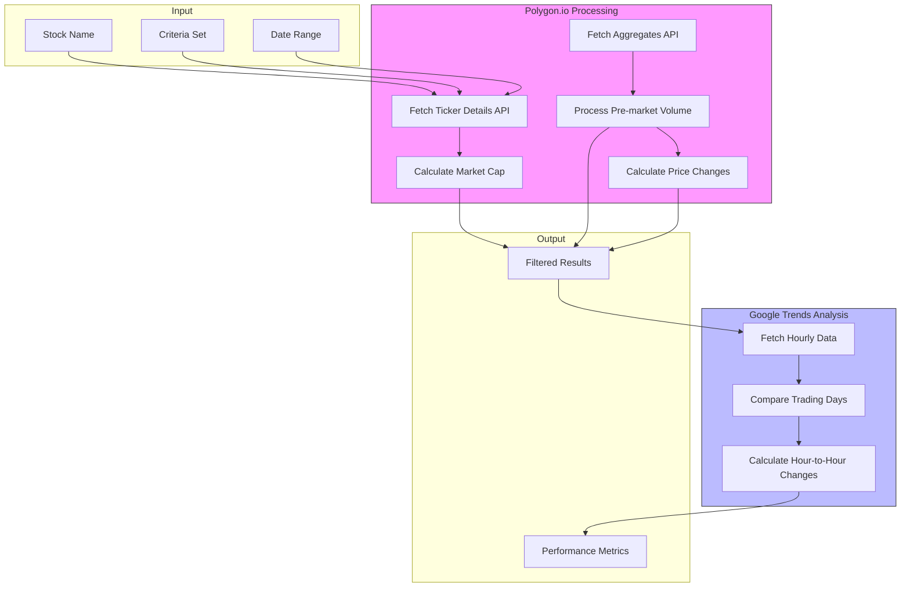

**Date**: January 7, 2025

**Time**: 21:00

**Participants**: Alex, Usama

## Previous Approach Status

- N8N implementation was determined unfeasible due to:
    - Higher than anticipated API call volume
    - Intensive processing requirements

## New Architecture Overview

### Function 1: [Polygon.io](http://polygon.io/) Data Processing

**Inputs**:

- Stock name
- Criteria set
- Date range (e.g., January 1, 2025)

**Processing Requirements**:

1. Fetch ticker details via Polygon API
2. Calculate market cap:
    - Formula: Shares outstanding × Open price
    - Minimum threshold: $100 million
3. Process pre-market data:
    - Time window: 4:00 AM - 9:29 AM ET
    - Aggregate minute-by-minute volume
4. Calculate performance metrics:
    - Open to high percentage
    - Open to close percentage

### Function 2: Google Trends Analysis

- Maintains existing functionality
- Focus on trading day comparisons
- Specific analysis of 4-5 AM and 5-6 AM patterns

## Technical Considerations

### Scale Analysis

- Approximate processing volume:
    - 11,000 tickers
    - 720 days (2 years)
    - Total processes: ~8 million

### Performance Optimization Strategies

1. Implement batch processing
2. Utilize async operations
3. Deploy multiple subprocesses (10-20)
4. Current estimates:
    - 91 days at 1 request/second
    - Optimization target: 40 requests/second

## Implementation Decisions

1. Processing Location:
    - To be run on Alex's infrastructure
    - Consultant to provide implementation code
2. Architecture Type:
    - Two separate function approach
    - Focus on modularity and scalability

## Action Items

### For Consultant

- [ ]  Implement two-function architecture
- [ ]  Develop parallel processing capability
- [ ]  Create documentation for running the system
- [ ]  Implement error handling and logging

### For Alex

- [ ]  Prepare infrastructure for processing
- [ ]  Review and test initial implementation
- [ ]  Determine preferred batch size for processing

## Next Steps

1. Consultant to begin implementation
2. Schedule review of initial code
3. Plan testing phase for single-day processing
4. Develop strategy for full historical processing

## Notes for Future Development

- Consider implementing checkpointing for long-running processes
- Monitor API rate limits
- Plan for error recovery
- Consider data storage strategy for processed results

## Technical Requirements Summary

### API Integration

1. Polygon.io Requirements:
    - Ticker details API access
    - Aggregate data API access
    - Minute-by-minute data capability
2. Data Processing:
    - Market cap calculations
    - Pre-market volume aggregation
    - Price change calculations
    - Trading day comparisons

### System Output

Required metrics for each processed stock:

1. Selection status based on criteria
2. Market volume metrics
3. Price performance data
4. Google Trends analysis results




https://polygon.io/docs/stocks/get_v3_reference_tickers__ticker#:~:text=share_class_shares_outstandingnumber

https://polygon.io/docs/stocks/get_v2_aggs_ticker__stocksticker__range__multiplier___timespan___from___to

OUt put Polygon

- Ticker Name
- IS SELECTED
- Values on the critera e.g gap etc
- Open _ High of the day percentage
- Open -> Close percentage Change


Gtrends data is relative. A significant spike in interest on one day cause earlier values to become smaller relatively in anytime frame but in this case 7 day window. so i will only be measuring “current trading day” or “specified date trading day” compared to previous trading day (mon-friday excluding days US market is closed for holidays and such).

This trading day/trading day relative change in the 7 day window (to receive hourly value points) is what i wish to collect and backtest.

Ex:

Today on the 7 day window, TSLA has values 70, 80, 100 or hours 4 5 and 6. Previous trading day has 30, 40, 60. This marks a total change of 120 or 92%  increase from yesterday(or friday if today is monday) to today. 

[Polygion.io](http://polygion.io/) will be used to filter which tickers will have the above gtrends fetching, analysis applied. A customizable filtering based on premarket volume, current price, and gap up percentage will be a good start.

# Old Code
```python
import os
import csv
from datetime import datetime, timedelta, timezone
from dotenv import load_dotenv
import aiohttp
import asyncio

# Load environment variables
load_dotenv()
API_KEY = os.getenv("SERPAPI_KEY")

if not API_KEY:
    raise ValueError("SERPAPI_KEY not found in environment variables.")

# Define PST timezone (UTC-8)
PST = timezone(timedelta(hours=-8))

def is_trading_day(date):
    return date.weekday() < 5  # Monday to Friday

def get_last_trading_day(current_date):
    last_day = current_date - timedelta(days=1)
    while not is_trading_day(last_day):
        last_day -= timedelta(days=1)
    return last_day

async def fetch_google_trends(keywords, current_date, batch_size=100):
    results = {}
    last_trading_day = get_last_trading_day(current_date)
    print(f"DEBUG: current_date (PST): {current_date}, last_trading_day: {last_trading_day}")

    async def fetch(session, keyword):
        params = {
            "q": keyword,
            "engine": "google_trends",
            "date": "now 7-d",
            "csv": "true",
            "no_cache": "true",
            "api_key": API_KEY,
            "tz": "480"  # PST (UTC-8)
        }

        try:
            async with session.get("https://serpapi.com/search", params=params) as response:
                if response.status == 200:
                    result = await response.json()
                    if "csv" in result:
                        return keyword, {
                            "data": result["csv"],
                            "last_trading_day": last_trading_day,
                        }
                else:
                    print(f"DEBUG: Non-200 status code for {keyword}: {response.status}")
                return keyword, None
        except Exception as e:
            print(f"Error for {keyword}: {e}")
            return keyword, None

    async with aiohttp.ClientSession() as session:
        for i in range(0, len(keywords), batch_size):
            batch = keywords[i:i + batch_size]
            tasks = [fetch(session, keyword) for keyword in batch]
            batch_results = await asyncio.gather(*tasks)

            for keyword, data in batch_results:
                if data:
                    results[keyword] = data
                else:
                    print(f"DEBUG: No data returned for {keyword}")

    return results

def filter_stocks(data, hours_to_check):
    filtered_results = []

    now_pst = datetime.now(PST)
    today_date = now_pst.date()
    print(f"DEBUG: Today in PST: {today_date}, Hours to check: {hours_to_check}")

    for keyword, info in data.items():
        csv_data = info["data"]
        last_trading_day = info["last_trading_day"]
        previous_day_values = {}
        current_day_values = {}

        print(f"\nDEBUG: Processing {keyword}")
        print(f"  Last trading day: {last_trading_day} (PST comparison)")
        print(f"  Number of CSV lines: {len(csv_data)}")

        for entry in csv_data:
            if "," in entry:
                try:
                    time_str, value_str = entry.split(",")
                    time_str = time_str.strip()
                    value_str = value_str.strip()

                    # Parse PST-based time
                    time_obj = datetime.strptime(time_str, "%Y-%m-%dT%H")
                    # Assign PST timezone
                    time_obj = time_obj.replace(tzinfo=PST)
                    value = int(value_str)

                    # Debug print for each data line that matches the relevant dates/hours
                    if time_obj.date() == last_trading_day.date() and time_obj.hour in hours_to_check:
                        previous_day_values[time_obj.hour] = value
                        print(f"  Previous day match: {time_obj}, value={value}")
                    elif time_obj.date() == today_date and time_obj.hour in hours_to_check:
                        current_day_values[time_obj.hour] = value
                        print(f"  Current day match: {time_obj}, value={value}")

                except ValueError:
                    # Skip invalid lines
                    continue

        print("  Previous day values:", previous_day_values)
        print("  Current day values:", current_day_values)

        matching_hours = set(previous_day_values.keys()) & set(current_day_values.keys())
        print("  Matching hours:", matching_hours)

        if matching_hours:
            previous_total = sum(previous_day_values[h] for h in matching_hours)
            current_total = sum(current_day_values[h] for h in matching_hours)
            print(f"  previous_total={previous_total}, current_total={current_total}")

            # Compute hourly changes for current day (4-5 and 5-6)
            hour_4_to_5 = None
            hour_5_to_6 = None
            # Only compute if these hours are present and nonzero
            if 4 in current_day_values and 5 in current_day_values and current_day_values[4] != 0:
                hour_4_to_5 = ((current_day_values[5] - current_day_values[4]) / current_day_values[4]) * 100
            if 5 in current_day_values and 6 in current_day_values and current_day_values[5] != 0:
                hour_5_to_6 = ((current_day_values[6] - current_day_values[5]) / current_day_values[5]) * 100

            if previous_total == 0:
                # If previous_total=0 and current_total>0, treat as infinite increase
                if current_total > 0:
                    percentage_change = 999999
                    print(f"  previous_total=0, current_total>0, treating as large increase.")
                    filtered_results.append({
                        "keyword": keyword,
                        "percentage_change": percentage_change,
                        "previous_total": previous_total,
                        "current_total": current_total,
                        "hours_considered": sorted(matching_hours),
                        "hour_4_to_5": hour_4_to_5,
                        "hour_5_to_6": hour_5_to_6,
                    })
                else:
                    # previous_total=0 and current_total=0, do nothing
                    print("  Both previous and current totals are 0, excluding keyword.")
            else:
                # Normal calculation when previous_total != 0
                percentage_change = ((current_total - previous_total) / previous_total) * 100
                print(f"  percentage_change={percentage_change:.2f}%")
                if percentage_change > 50:
                    filtered_results.append({
                        "keyword": keyword,
                        "percentage_change": percentage_change,
                        "previous_total": previous_total,
                        "current_total": current_total,
                        "hours_considered": sorted(matching_hours),
                        "hour_4_to_5": hour_4_to_5,
                        "hour_5_to_6": hour_5_to_6,
                    })

    return filtered_results

def write_to_csv(filtered_results, filename="filtered_results.csv"):
    with open(filename, mode="w", newline="", encoding="utf-8") as file:
        writer = csv.writer(file)
        writer.writerow([
            "Keyword",
            "Percentage Change",
            "Previous Total",
            "Current Total",
            "Hours Considered",
            "4-5 % Change (Today)",
            "5-6 % Change (Today)"
        ])
        for result in filtered_results:
            # Format hour-to-hour changes, handle None as "N/A"
            h_4_to_5_str = f"{result['hour_4_to_5']:.2f}%" if result["hour_4_to_5"] is not None else "N/A"
            h_5_to_6_str = f"{result['hour_5_to_6']:.2f}%" if result["hour_5_to_6"] is not None else "N/A"

            writer.writerow([
                result["keyword"],
                f"{result['percentage_change']:.2f}%",
                result["previous_total"],
                result["current_total"],
                ", ".join(map(str, result["hours_considered"])),
                h_4_to_5_str,
                h_5_to_6_str
            ])

if __name__ == "__main__":
    keywords_file = "keywords.txt"
    with open(keywords_file, "r") as f:
        stock_keywords = [line.strip() for line in f]

    # hours_to_check are already [4, 5, 6] as previously set
    hours_to_check = [4, 5, 6]  # PST hours

    print("Running in Premarket Analysis mode...")

    print("Fetching Google Trends data...")
    current_date = datetime.now(PST)
    trends_data = asyncio.run(fetch_google_trends(stock_keywords, current_date))

    print(f"Filtering stocks with >50% cumulative increase in search volume ({hours_to_check[0]} - {hours_to_check[-1]} PST)...")
    filtered_stocks = filter_stocks(trends_data, hours_to_check)

    print("Writing filtered results to CSV...")
    write_to_csv(filtered_stocks)
    print("Filtered results have been saved to filtered_results.csv.")

```

### Criteria
* MIN_PREMARKET_VOLUME = 50000   | Pre_Market_volume = Sum of volume each minute between 4AM-9:29 AM ET  
* MIN_PRICE = 3
* MIN_GAP_UP = 2       | gap_up = ((current_price - prev_close) / prev_close * 100
* Market_Cap > 100 M |   market_cap = Share_Outstanding * Open_Price @ day
 